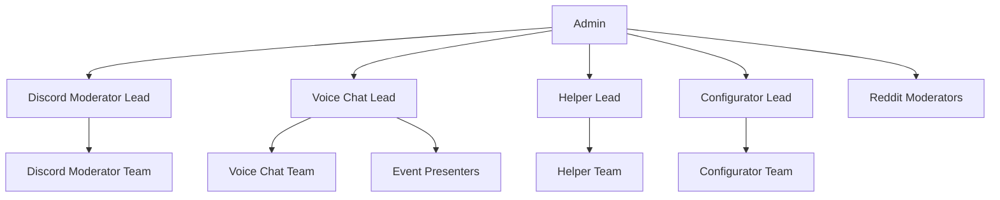

Hi! This repository is our workspace for documenting how the OpenClaw Discord server is run.
It's written from the perspective of myself and the other Team Leads, but is open source for transparency.

This is a living document, anything can and will be changed at any time without warning. The only exception is the Rules, which will have changes announced in the #announcements channel within the server.
If you think that something should be changed in our policies, feel free to open a GitHub issue here on this repo.

**This repository is not the place to appeal moderation actions or report a moderator. This is solely to house and discuss our policies.** If you want to appeal a moderation action or report a moderator, please go to https://appeal.gg/clawd and submit the form there.

# Table of Contents

- [Mod Onboarding](onboarding.md)
- [Moderation Guide](moderation.md)
- [Rules (Mirror)](rules.md)
- [Roles Reference](roles.md)
- [Incident Playbook](incident-playbook.md)

# Teams

Our Community Staff is made up of 4 different teams. Each team has a lead, and the leads report to the Admin. The Admin is the final person who will make decisions regarding the server, but they will often ask for input from the leads before making a decision.
Staff can be in one or more teams as deemed acceptable by the Team Leads. All together, our entire team is referred to as the Community Staff.

## Hierarchy

### Discord Moderator (text)

- Owns all text channels that are not support-only or staff-only.
- Handles general rule enforcement, thread hygiene, and member guidance in text.
- Coordinates with Helpers when a support issue appears in general chat.

### VC Moderator (voice)

- Owns all voice channels and VC events.
- Handles voice-specific incidents (hot mic, soundboard spam, VC trolling).
- Uses `/report-vc` for any voice moderation actions when possible.

### Helper (support)

- Owns support channels: #help, #users-helping-users, #models.
- Handles OpenClaw product/support questions and triage.
- Escalates bugs or account issues to the Admin as needed.

### Configurator (administration)

- Owns server configuration, permissions, and bot management.
- Maintains automod, role config, and tooling (Barnacle/Audrey/Answer Overflow).
- Coordinates with leads before changes that affect member experience.

### Admin Responsibilities

- Owns final decisions, policy updates, and lead assignments.
- Oversees escalations and high-risk moderation cases.
- Oversees Github moderation and Reddit supervision.
- Coordinates cross-team projects and staffing coverage.

## Current Team Leads

### Admin: Shadow
- X: [@4shad0wed](https://x.com/4shad0wed)
- Discord: @4shadowed

### Discord Moderator Lead: Shadow
- X: [@4shad0wed](https://x.com/4shad0wed)
- Discord: @4shadowed

### Voice Chat Lead: AndyML
- X: [@alauppe](https://x.com/alauppe)
- Discord: @andyml_

### Helper Lead: Julian Engel
- X: [@julianengel](https://x.com/julianengel)
- Discord: @julianengel13

### Configurator Lead: Strife
- X: [@SinOfStrife](https://x.com/SinOfStrife)
- Discord: @corvus_bane

## Applying

We accept staff applications by email. Send a short, human-written note to **shadow@openclaw.ai** with the details below.

**Subject:** `Staff application – <your Discord handle>`

**Include:**
- **Experience:** moderation, community leadership, support, or ops experience (links welcome).
- **Handles:** Discord, GitHub, X (Twitter), plus your best contact email.
- **Availability:** timezone + typical hours/week.
- **Preferred team(s):** which team(s) and why.
- **Recommendation(s):** who can vouch for you, and how to contact them.
- **Extras:** languages, prior OpenClaw involvement, or relevant projects.

We’ll follow up (generally via Discord) if there’s a fit or we need more info.
