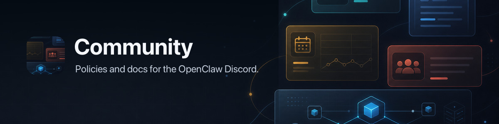
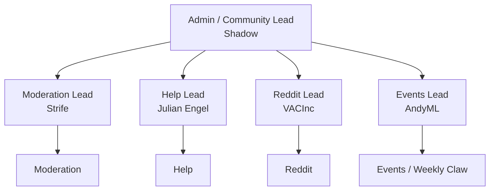

Hi! This repository is our workspace for documenting how the OpenClaw Discord server is run.

It's written from the perspective of myself and the other leads, but is open source for transparency.

This is a living document, anything can and will be changed at any time without warning. The only exception is the Rules, which will have changes announced in the #announcements channel within the server.
If you think that something should be changed in our policies, feel free to open a GitHub issue here on this repo.

**This repository is not the place to appeal moderation actions or report a moderator. This is solely to house and discuss our policies.** If you want to appeal a moderation action or report a moderator, use the forms at https://appeals.openclaw.ai.

# Table of Contents

- [Mod Onboarding](onboarding.md)
- [Moderation Guide](moderation.md)
- [Rules (Mirror)](rules.md)
- [Roles Reference](roles.md)
- [Incident Playbook](incident-playbook.md)
- [Appeals and Moderator Reports](appeals-and-reports.md)
- [Bot Reference](bot-management.md)

# Community Staff Structure

Community Staff is the volunteer team that supports OpenClaw's community spaces. Staff help with moderation, support, events, Reddit, and community operations. The Admin owns final decisions, policy updates, staffing, and escalations, but will often ask the leads for input before making major decisions.

Community Staff is not split into separate teams. Instead, there are areas of responsibility that Community Staff work on together, with leads responsible for coordination and final direction in each area. Staff may help across areas as needed.

## Hierarchy

```mermaid
flowchart TD
  A[Admin / Community Lead<br/>Shadow]

  A --> ML[Moderation Lead<br/>Strife]
  ML --> M[Moderation]

  A --> HL[Help Lead<br/>Julian Engel]
  HL --> H[Help]

  A --> RL[Reddit Lead<br/>VACInc]
  RL --> R[Reddit]

  A --> EL[Events Lead<br/>AndyML]
  EL --> E[Events / Weekly Claw]
```

## Areas of Responsibility

### Moderation

- Owns rule enforcement across Discord text and voice spaces.
- Handles general moderation, thread hygiene, member guidance, and incident response.
- Uses Barnacle for Discord moderation actions and `/report-vc` for voice incidents when possible.
- Coordinates with staff working in the help area when a support issue appears in general chat.

### Help

- Owns support channels such as #help, #users-helping-users, and model/support discussion spaces.
- Handles OpenClaw product/support questions and triage.
- Reviews `/claim` requests for the Clawtributor role.
- Escalates bugs, account issues, or unclear cases to the Admin or relevant lead.

### Reddit

- Owns the r/OpenClaw and r/Clawdbot subreddits.
- Handles subreddit moderation, rule enforcement, and community engagement on Reddit.
- Coordinates sponsorship/event/community opportunities with the Admin and foundation contact paths when needed.

### Events

- Owns recurring community events, including Weekly Claw.
- Coordinates event presenters, recordings, and event chat/community experience.
- Works with the Admin before launching new official outreach or event programs.

## Elevated Permissions

These are not areas of responsibility or separate teams. They are extra permissions granted to specific staff who need them.

### Bot Managers

- Maintain bot dashboards, bot configuration, automod settings, and operational tooling.
- Coordinate with the Admin and relevant lead before changes that affect member experience.

### GitHub Moderators

- Handle moderation needs on GitHub when maintainers or community staff escalate an issue.
- Use #github-moderation for coordination.
- This is an elevated permission group, not a separate staff area.

Current GitHub Moderator:

- Hannes Rudolph (`@hannesrudolph`)

## Backup Discord Server

The backup Discord server remains available at https://discord.gg/openclaw.

It is kept as a public fallback space in case the main server is unavailable. The backup server is not intended to replace the main community during normal operations and may have no writable public channels unless it is needed.

# Current Leads

### Admin / Community Lead: Shadow
- X: [@4shadowed](https://x.com/4shadowed)
- Discord: @4shadowed

### Moderation Lead: Strife
- X: [@SinOfStrife](https://x.com/SinOfStrife)
- Discord: @corvus_bane

### Reddit Lead: VACInc
- Reddit: [u/vacinc](https://reddit.com/u/vacinc)
- X: [@vacinc](https://x.com/vacinc)
- Discord: VACInc

### Events Lead: AndyML
- X: [@alauppe](https://x.com/alauppe)
- Discord: @andyml_

### Help Lead: Julian Engel
- X: [@julianengel](https://x.com/julianengel)
- Discord: @julianengel13

# Applying

We accept staff applications by email. Send a short, **__human-written__** note to **shadow@openclaw.ai** with the details below.

**Subject:** `Staff application – <your Discord handle>`

**Include:**
- **Experience:** moderation, community leadership, support, or ops experience (links welcome).
- **Handles:** Discord, GitHub, X (Twitter), plus your best contact email.
- **Availability:** timezone + typical hours/week.
- **Preferred area(s):** moderation, help, events, Reddit, bots, GitHub moderation, or another area you want to help with.
- **Recommendation(s):** who can vouch for you, and how to contact them.
- **Extras:** languages, prior OpenClaw involvement, or relevant projects.

We’ll follow up (generally via Discord) if there’s a fit or we need more info.
