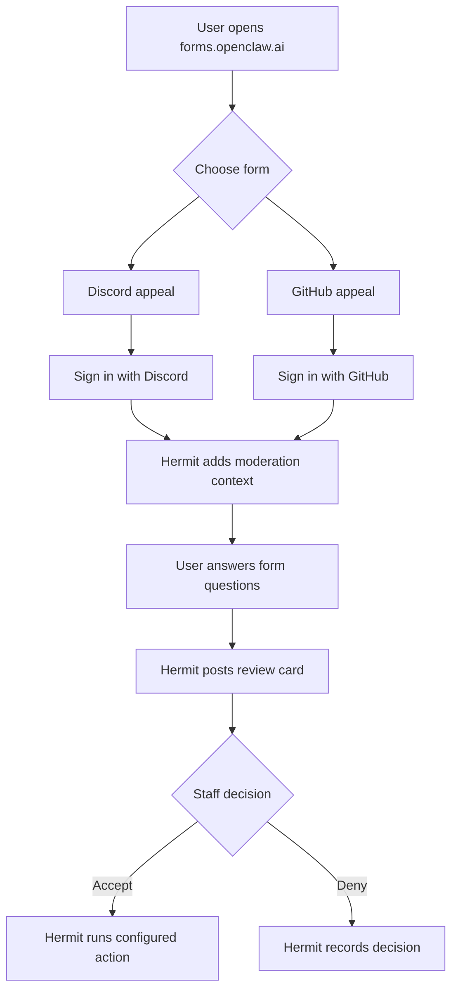

# Appeals and Moderator Reports

OpenClaw uses Hermit Forms for moderation appeals and moderator reports.

Primary forms host:

- https://forms.openclaw.ai

## User-facing forms

| Form | Path | Auth options | Review channel |
| --- | --- | --- | --- |
| Discord ban appeal | `/discord-ban` | Discord | `#cs-appeals` |
| Discord mute appeal | `/discord-mute` | Discord | `#cs-appeals` |
| GitHub appeal | `/github` | GitHub | `#cs-appeals` |
| Report a Moderator | `/report-mod` | Discord or GitHub | `#shadow` |

Use these links when directing users:

- Discord ban appeal: https://forms.openclaw.ai/discord-ban
- Discord mute appeal: https://forms.openclaw.ai/discord-mute
- GitHub appeal: https://forms.openclaw.ai/github
- Report a moderator: https://forms.openclaw.ai/report-mod

## Appeal flow

## How staff should review appeals

Appeals should be handled by someone other than the moderator who issued the action. If you issued the original action, ask another moderator, lead, or the Admin to handle the appeal.

Review cards appear in `#cs-appeals`. Use the buttons on the review card:

- **Accept**: records the appeal as accepted and runs the configured action.
- **Deny**: records the appeal as denied.

Configured accept actions:

- Discord ban appeal: unbans the user.
- Discord mute appeal: removes the active timeout.
- GitHub appeal: unblocks the user from the OpenClaw GitHub organization.
Deny does not run an external action.

## Report a Moderator flow

Reports against moderators go to `#shadow`, not `#cs-appeals`.

The report form asks:

- who is being reported,
- why they are being reported,
- confirmation that the reporter understands false reports may result in punishment.

Users may authenticate with Discord or GitHub for this form. Reports should be handled by the Admin or a specifically delegated lead.

## Reddit moderation context

Reddit appeal forms are not currently exposed on the public forms host.

Reddit moderation context is supplied by a Devvit app installed for `r/openclaw`. The Devvit app sends Hermit the current moderation context for a Reddit user, including whether they are banned and the listed reason when available.

The Devvit bridge can execute Reddit unban actions when a Reddit appeal flow is enabled.
