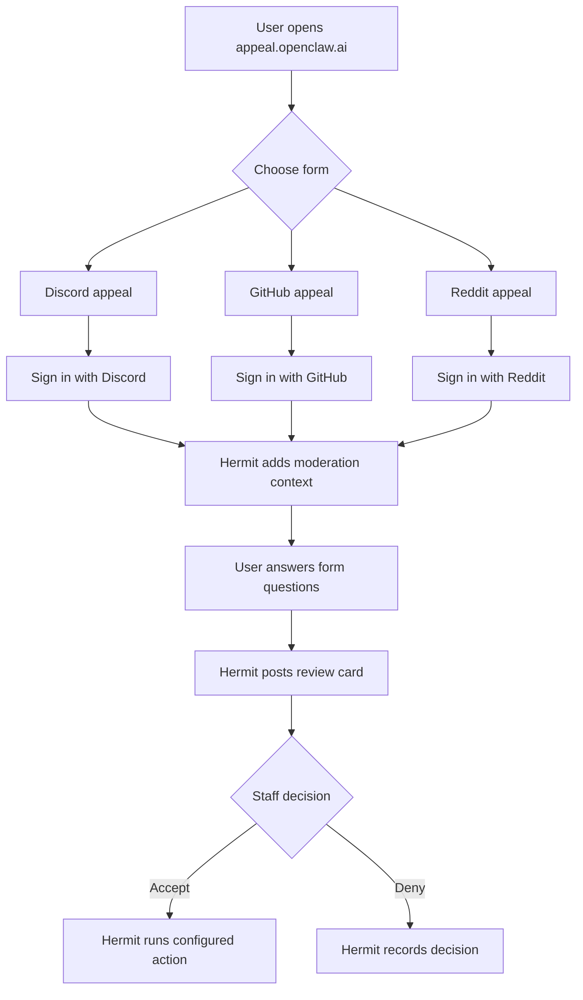

# Appeals and Moderator Reports

OpenClaw uses Hermit Forms for moderation appeals and moderator reports.

Primary forms hosts:

- https://appeal.openclaw.ai
- https://forms.openclaw.ai

Both hosts are first-class. Neither host is a legacy alias.

## User-facing forms

| Form | Path | Auth options | Review channel |
| --- | --- | --- | --- |
| Discord ban appeal | `/discord-ban` | Discord | `#cs-appeals` |
| Discord mute appeal | `/discord-mute` | Discord | `#cs-appeals` |
| GitHub appeal | `/github` | GitHub | `#cs-appeals` |
| Reddit appeal | `/reddit` | Reddit | `#cs-appeals` |
| Report a Moderator | `/report-mod` | Discord, GitHub, or Reddit | `#shadow` |

Use these links when directing users:

- Discord ban appeal: https://appeal.openclaw.ai/discord-ban
- Discord mute appeal: https://appeal.openclaw.ai/discord-mute
- GitHub appeal: https://appeal.openclaw.ai/github
- Reddit appeal: https://appeal.openclaw.ai/reddit
- Report a moderator: https://appeal.openclaw.ai/report-mod

## Appeal flow

## How staff should review appeals

Appeals should be handled by someone other than the moderator who issued the action. If you issued the original action, ask another moderator, lead, or the Admin to handle the appeal.

Review cards appear in `#cs-appeals`. Use the buttons on the review card:

- **Accept**: records the appeal as accepted and runs the configured action.
- **Deny**: records the appeal as denied.

Configured accept actions:

- Discord ban appeal: unbans the user.
- Discord mute appeal: removes the active timeout.
- GitHub appeal: unblocks the user from the OpenClaw GitHub organization.
- Reddit appeal: asks the Devvit Reddit bridge to unban the user from `r/openclaw`, then updates Hermit's stored Reddit moderation context.

Deny does not run an external action.

## Report a Moderator flow

Reports against moderators go to `#shadow`, not `#cs-appeals`.

The report form asks:

- who is being reported,
- why they are being reported,
- confirmation that the reporter understands false reports may result in punishment.

Users may authenticate with Discord, GitHub, or Reddit for this form. Reports should be handled by the Admin or a specifically delegated lead.

## Reddit moderation context

Reddit appeals use Reddit OAuth for identity only. Hermit does not hold Reddit moderator OAuth tokens.

Reddit moderation context is supplied by a Devvit app installed for `r/openclaw`. The Devvit app sends Hermit the current moderation context for a Reddit user, including whether they are banned and the listed reason when available.

The Devvit bridge is also responsible for executing Reddit unban actions when a Reddit appeal is accepted.
