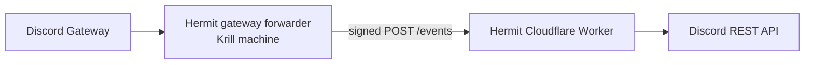

This is a list of all the bots that are currently in the server and where to manage them.

Bot/configuration access is handled by Bot Managers. Bot Managers are an elevated permission group, not a separate Community Staff team.

# External

## Kiai
Used for message and voice tracking
https://kiai.app

## Answer Overflow
Used for SEO and #help management
https://answeroverflow.com

## Barnacle
Whitelabel bot of https://sapph.xyz, used for Discord moderation commands and moderation records.

## Audrey
Used for automod in voice channels, especially for soundboard spam and VC trolling, and the /report-vc command
https://audrey.gg

## Craig
Used for recording voice channels and events
Managed through commands only.

## ChannelBot
Misc utility bot managed solely through commands

# Internal

## Hermit
Custom bot - https://github.com/openclaw/hermit

Hermit is split into two runtime pieces:

- Main bot: Cloudflare Worker. This owns slash commands, interactions, scheduled tasks, D1-backed state, and webhook/event handling.
- Gateway forwarder: Bun process in `forwarder/`, running on Krill's machine. This holds the persistent Discord Gateway connection and forwards gateway events to the Worker.

### Current stack

Main Worker:

- Carbon (`@buape/carbon`) with the fetch adapter.
- Cloudflare Workers via Wrangler.
- Bun for dependency management and local scripts.
- Cloudflare D1 for persistent state.
- Drizzle ORM for schema and migrations.
- Carbon message/event listeners for Discord automod responses, auto-publish, thread welcome, and GIF repost behavior.

Gateway forwarder:

- Carbon Gateway Forwarder plugin (`@buape/carbon/gateway-forwarder`).
- Bun runtime on Krill's machine.
- Bun for dependency management, TypeScript execution, and run scripts.

The old in-Worker Cloudflare Gateway Durable Object setup is no longer the active gateway path. Gateway events now come through the external forwarder.

### Hermit Forms

Hermit runs the OpenClaw forms site for appeals and moderator reports.

Forms host:

- https://appeals.openclaw.ai

Forms configuration lives in Hermit's root `forms.config.ts`. That file is the source of truth for form IDs, copy, review channels, and accept/deny actions.

Current forms:

| Form | Path | Review channel |
| --- | --- | --- |
| Discord ban appeal | `/discord-ban` | `#cs-appeals` |
| Discord mute appeal | `/discord-mute` | `#cs-appeals` |
| GitHub appeal | `/github` | `#cs-appeals` |
| Report a Moderator | `/report-mod` | `#shadow` |

Reddit moderation context and Reddit unban actions are handled through a Devvit bridge, but a Reddit appeal form is not currently exposed on the public forms host.

### Hermit D1 and deploy setup

Hermit uses Cloudflare D1 for persistent bot state, including clawtributor claim dedupe, Forms submissions, Reddit moderation context, and other operational records. Drizzle owns the TypeScript schema and generates SQL migration files in the repo; Wrangler applies those migrations to the Cloudflare D1 database.

Relevant repo paths:

```text
src/db/schema.ts
drizzle/
wrangler.jsonc
```

Operational model:

- Cloudflare Workers Builds deploys Hermit from the `main` branch.
- The Cloudflare Builds deploy command should be `bun run deploy:cf`.
- `bun run deploy:cf` runs remote D1 migrations first, then deploys the Worker.
- Do not add a separate GitHub Actions deploy workflow for Hermit; Cloudflare Builds is the deployment source of truth.
- `wrangler.jsonc` should keep the D1 binding named `DB` and `migrations_dir` set to `drizzle`.

Useful commands:

```bash
bun run db:generate      # generate Drizzle SQL migrations
bun run db:apply:local   # apply migrations to local D1
bun run db:apply:remote  # apply migrations to production D1
bun run deploy:cf        # Cloudflare Builds deploy command: migrate, then deploy
```

D1 migration changes should be reviewed carefully before merge. If a migration is merged, confirm Cloudflare Builds is still configured to run `bun run deploy:cf`; otherwise the Worker may deploy without its expected database schema.

### Hermit gateway forwarder setup

The forwarder exists because the main Hermit bot runs on Cloudflare Workers, while Discord Gateway connections need a long-lived process. The forwarder connects to Discord, listens for gateway events, signs each event, and sends it to the Worker's `/events` route.

Flow:



Forwarder location in repo:

```text
forwarder/
```

Forwarder required env vars:

```env
BASE_URL=
DEPLOY_SECRET=
DISCORD_CLIENT_ID=
DISCORD_PUBLIC_KEY=
DISCORD_BOT_TOKEN=
FORWARDER_PRIVATE_KEY=
```

`BASE_URL`, `DEPLOY_SECRET`, `DISCORD_CLIENT_ID`, `DISCORD_PUBLIC_KEY`, and `DISCORD_BOT_TOKEN` should match the main bot's credentials. `FORWARDER_PRIVATE_KEY` is the Ed25519 private key used only by the forwarder.

Main Worker required extra secret:

```env
FORWARDER_PUBLIC_KEY=
```

Set the Worker public key secret with:

```bash
bunx wrangler secret put FORWARDER_PUBLIC_KEY
```

Operational notes:

- Do not commit `forwarder/.env` or private keys.
- If the forwarder keypair changes, update `FORWARDER_PRIVATE_KEY` on Krill's machine and `FORWARDER_PUBLIC_KEY` in Cloudflare.
- The Worker verifies forwarded events against `FORWARDER_PUBLIC_KEY`; Discord interactions still use `DISCORD_PUBLIC_KEY`.
- The forwarder currently requests `Guilds`, `GuildMessages`, and `MessageContent` gateway intents.
- Start commands from `forwarder/`: `bun run dev` for watch mode, or `bun run start` for normal runtime.

## Clawd
Foundation OpenClaw instance.

## Claw Sweeper
OpenClaw instance for automated GitHub QA, rebasing, and merge assistance.

## Krill
OpenClaw instance that functions as our support bot in #help and #ideas.
Community Staff can ping Krill in any channel for support, triage, or member guidance.
Hosted on Julian's Hetzner instance.

Krill will also handle international channel translation through a separate translation workspace, replacing Babelfish.

## Mantis
OpenClaw instance for QA workflows, including spinning up test environments and producing review artifacts.

## Molty
Peter's personal OpenClaw instance, maintainers only.

## Tideclaw
OpenClaw instance for alpha and beta release automation.

## Flawd
RIP.
