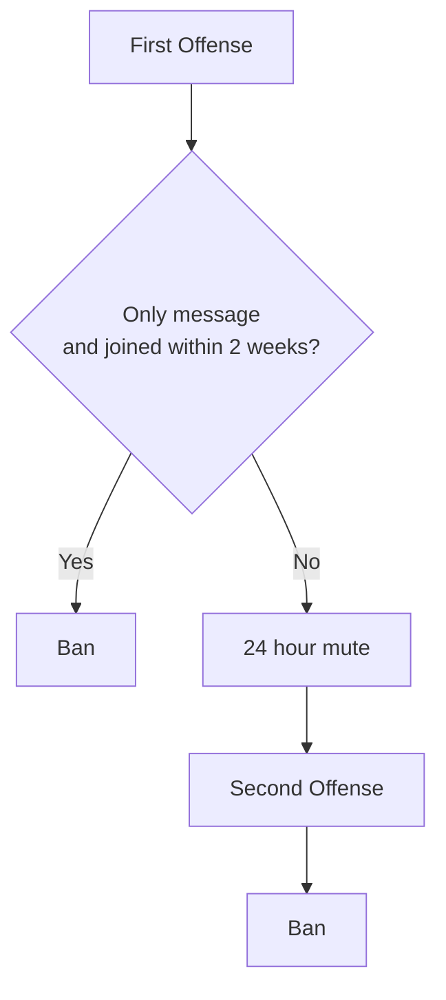

# Incident Playbook

Use this as a quick-response guide. Always use Barnacle (Sapphire) moderation commands, not native Discord moderation tools.

### **__If you do any moderation actions because of something in the Voice Channels, please use /report-vc as well so there is evidence of it for when people complain to the Admin or leads__**

## Common Moderation Cases

These are punishment times we should standardize on for these common offenses.

### Self Promotion outside of #showcase

If you type just `ad` as the reason (not plural), it'll expand itself to a reason explaining to use #showcase for self-promo.

Discord invites are not allowed anywhere, including #showcase.

### #showcase forum moderation

#showcase is a forum channel for members to show off projects, setups, and other promotional work. It is intentionally moderated more lightly than general chat. Promo that would be removed elsewhere is allowed here, as long as it follows the rest of the server rules.

Remove or moderate #showcase posts for Discord invites, crypto/trading/prediction-market content, NSFW or graphic content, harassment, spam, trolling, or anything that is clearly unsafe for the community. Escalate repeat #showcase abuse to a lead or the Admin.

### Trolling in chat

If they are a brand new join, they should be banned. Otherwise, they should get a 24 hour mute.

### Crypto / Trading / Prediction Markets

If they're joking about it, use a 1 hour /mute

If they're serious about it, instantly ban.

__**This is a firm rule, no exceptions.**__

### Hot Mic

Right click and disconnect. If they rejoin with the same, mute for 30 minutes

### Soundboard Spam

Should be automatically handled by Audrey. If they continue past what Audrey handles, mute for 1 hour

### Any Rule 3 violations

First offense is a ban for 24 hours unless it was particularly egregious, in which case, skip to a ban. Second offense is a ban.

### Recruiting for jobs / "Does anyone need a developer"

Instant ban

### Doxxing / personal data

Remove content immediately and ban involved users. Then, escalate to Admin right away.

### Other

Use your best judgement. If a mute is longer than 3 days, it should be a temporary ban instead.
